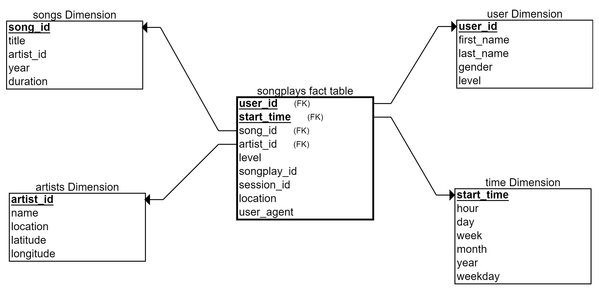

# Project: Data Pipelines with Apache Airflow

## Introduction

<p>Sparkify, a music streaming company, has decided to automate and monitor their data warehouse ETL pipelines more effectively. They have chosen Apache Airflow as the most suitable tool for this task.</p>

<p>The objective is to construct high-quality data pipelines that are dynamic, reusable, monitorable, and allow for easy backfilling. After the ETL steps are executed, tests should be run on their datasets to identify any discrepancies.</p>

<p>The source data, which consists of JSON logs detailing user activity in the application and JSON metadata about the songs users listen to, is stored in S3 and needs to be processed in Sparkify’s data warehouse in Amazon Redshift.</p>

## Datasets

This project utilizes two datasets. The S3 links for each are as follows:

>**s3://udacity-dend/song_data/**<br>
>**s3://udacity-dend/log_data/**

## Data Modeling wih Star Schema



## Configuring the DAG

In the DAG, add default parameters according to these guidelines

1. The DAG does not have dependencies on past runs
2. On failure, the task are retried 3 times
3. Retries happen every 5 minutes
4. Catchup is turned off
5. Do not email on retry

In addition, configure the task dependencies so that after the dependencies are set, the graph view follows the flow shown in the image below.


**Configure the task dependencies**
```
start_operator  \
    >> create_trips_table \
    >> [stage_events_to_redshift, stage_songs_to_redshift] \
    >> load_songplays_table \
    >> [ load_songs_table, load_artists_table, load_time_table, load_users_table] \
    >> run_quality_checks \
    >> end_operator
```

## Project Files

This project workspace includes 2 folders: dags, plugins 

>- The **spakify_dag.py** includes all the imports, tasks and task dependencies <br>
>- The **operators** folder includes 4 user defined operators  that will stage the data, transform the data, fill the data warehouse, and run checks on data quality. <br>
>- A **helper** class for the SQL transformations

## Building the operators

### Stage Operator
<p>The stage operator is designed to load JSON formatted files from S3 into Amazon Redshift. It generates and executes a SQL COPY statement based on the provided parameters. These parameters should define the S3 location of the file to be loaded and the target table in Redshift.</p>

<p>These parameters should also help differentiate between various JSON files. An essential feature of the stage operator is a templated field that enables it to load timestamped files from S3, based on the execution time, and perform backfills.</p>

### Fact and Dimension Operators
<p>The fact and dimension operators allow you to use the provided SQL helper class to execute data transformations. The bulk of the logic resides within the SQL transformations, and the operator is expected to take a SQL statement and a target database to run the query against as input. You can also specify a target table that will hold the transformation results.</p>

<p>Dimension loads are typically performed using the truncate-insert pattern where the target table is cleared before the load. Therefore, you could include a parameter that enables switching between insert modes when loading dimensions. Fact tables are usually so large that they should only support append type functionality.</p>

### Data Quality Operator
<p>The last operator to construct is the data quality operator, which is utilized to perform checks on the data. The primary function of this operator is to take one or more SQL-based test cases along with the expected results and run the tests. For each test, the test result and expected result are compared, and if they do not match, the operator should raise an exception, causing the task to retry and eventually fail.</p>

## Add Airflow Connections to AWS

Use Airflow's UI to configure your AWS credentials and connection to Redshift.

1. Click on the Admin tab and select Connections.


2. Under Connections, select Create. <br>


3. On the create connection page, enter the following values:

>- **Conn Id**: Enter aws_credentials.
>- **Conn Type**: Enter Amazon Web Services.
>- **Login**: Enter your Access key ID from the IAM User credentials you downloaded earlier.
>- **Password**: Enter your Secret access key from the IAM User credentials you downloaded earlier.
Once you've entered these values, select Save and Add Another.


4. On the next create connection page, enter the following values:

>- **Conn Id**: Enter redshift.
>- **Conn Type**: Enter Postgres.
>- **Host**: Enter the endpoint of your Redshift cluster, excluding the port at the end. You can find this by selecting your cluster in the Clusters page of the Amazon Redshift console. See where this is located in the screenshot below. IMPORTANT: Make sure to NOT include the port at the end of the Redshift endpoint string.
>- **Schema**: Enter dev. This is the Redshift database you want to connect to.
>- **Login**: Enter awsuser.
>- **Password**: Enter the password you created when launching your Redshift cluster.
>- **Port**: Enter **5439**. <br>


Once you've entered these values, select **Save**.

## Author

**Ramanathan**
